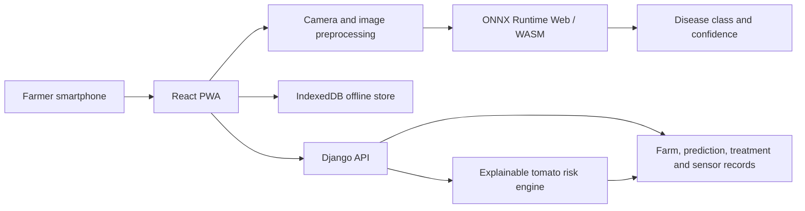

CropGuard: Offline Crop Disease Detection and Risk Guidance

CropGuard is a multilingual progressive web application for early tomato-disease
screening. A farmer captures a leaf photograph, receives an on-device prediction,
and gets prevention or treatment guidance even when connectivity is unreliable.
When a connection is available, prediction records and field observations can be
associated with a farm and synchronized with the Django backend.

This repository is a working demonstration and a foundation for field validation;
it is not yet a clinically or agronomically validated diagnostic service.

## 1. Idea Overview
### Problem

Small and marginal farmers may identify a disease only after visible spread. Expert
advice is not always immediately available, rural connectivity can be intermittent,
and a generic treatment recommendation may not reflect the conditions in a specific
field.
### Proposed solution

CropGuard combines three signals in one workflow:
1. **Leaf-image screening:** an ONNX model classifies four tomato leaf conditions:
	bacterial spot, early blight, late blight, and Septoria leaf spot.
2. **Environmental risk:** an explainable rule engine scores disease-favouring
	temperature, humidity, rainfall, soil moisture, and duration patterns.
3. **Actionable guidance:** disease prevention and treatment content is available in
	English, Hindi, Punjabi, Bengali, and Tamil, with offline history and later sync.
The image result is a screening signal, not a replacement for an agronomist,
laboratory test, or pesticide label.

## 2. Technical Approach
### Architecture



### Software
- **Frontend:** React 19, React Router, Vite, and `vite-plugin-pwa`.
- **Inference:** `onnxruntime-web` with the WebAssembly execution provider. The
	bundled `public/weights_final_.onnx` model is loaded in the browser; captured
	images are resized to 224 x 224 and converted to a float32 RGB tensor.
- **Offline-first data:** IndexedDB is used through Dexie and `idb`. Prediction
	records have client identifiers and sync states so interrupted connectivity does
	not require repeating a screening.
- **Internationalization:** `i18next` and `react-i18next`; prevention guides are
	stored in the repository as Markdown.
- **Backend:** Django 5.2, Django REST Framework 3.18, JWT authentication, CORS
	support, and a relational database configured by Django settings.
- **Backend responsibilities:** farmer profiles, farms, sensor nodes, sensor
	readings, prediction uploads, feedback, treatment recommendations, and risk
	score APIs.
- **Risk logic:** a deterministic, weighted-threshold Python engine. Scores are
	mapped to low, moderate, high, and critical bands. It estimates leaf wetness from
	humidity and rainfall because the current design does not include a leaf-wetness
	sensor.

### Hardware and deployment
- **Current demonstration hardware:** a modern smartphone or laptop with a camera,
  browser, local storage, and enough memory to cache the PWA and ONNX model.
- **Planned field hardware:** a low-power sensor node measuring temperature,
	relative humidity, soil moisture, and rainfall. The backend models `SensorNode`
	and `SensorReading`, but this repository does not contain microcontroller firmware,
	a wiring design, or a validated sensor bill of materials.
- **Connectivity:** internet is needed for authentication, server APIs, uploads,
  and synchronization. Image inference and cached guidance can work offline after
  the PWA and model have been cached.
- **Security and privacy:** use HTTPS in deployment, restrict CORS, protect JWT
	secrets, validate uploads, and define a retention policy for farmer phone numbers,
	field coordinates, and crop images before production use.

### Local setup

Frontend:
```bash
npm install
npm run dev
```

Quality and production build:
```bash
npm run lint
npm run build
```

Backend:
```bash
cd agritech_backend
python -m venv .venv
# Windows PowerShell
.\.venv\Scripts\Activate.ps1
pip install -r requirements.txt
python manage.py migrate
python manage.py runserver
```

The Django development server runs at `http://127.0.0.1:8000/`. Set
`VITE_API_URL` when the frontend should use a backend other than the default
`/api` proxy path.

## 3. Feasibility and Viability

### Why the approach is feasible

- The main workflow uses hardware farmers already possess: a phone camera.
- Browser inference avoids sending every image to a server, reducing latency,
	bandwidth use, and exposure of farm images.
- A four-class model and 224 x 224 input are practical for a cached WebAssembly
	inference path on current smartphones, subject to field-device benchmarking.
- The rule engine is inspectable and can be calibrated against local extension data
	without requiring a large labelled outbreak dataset.
- The PWA, local database, and sync-ready API address intermittent connectivity.

### Why the problem matters

FAO reports that plant pests and diseases can destroy up to **40% of global crop
production each year**, with annual economic losses exceeding **USD 220 billion**.
This establishes the scale of the problem, but it is not a claim that CropGuard
will prevent 40% of losses. Its viability depends on a staged pilot measuring
accuracy, time-to-advice, adoption, false alarms, and changes in avoidable loss.

### Pilot viability gates

Before a production decision, test the system on geographically and seasonally
diverse field images. Report per-class precision, recall, F1 score, calibration,
abstention or escalation behaviour, offline latency, sync success rate, and farmer
comprehension. Risk thresholds must be compared with actual weather, sensor, and
disease observations and reviewed by local agronomists.

## 4. Potential Impact and Benefits

The following calculation is an evidence-based scenario, not a measured product
result:

- Published evidence gives an upper-bound context of 40% crop loss from pests and
	diseases globally (FAO citation below).
- Suppose a pilot has 100 farms, each representing one hectare, and the tool helps
	avoid only **5% of the otherwise occurring disease loss**.
- Recovered share of normal production is `0.40 x 0.05 = 0.02`, or **2%**.
- Across the pilot, that is `100 hectares x 2% = 2 hectare-equivalents` of
	production preserved, before assigning a crop-specific yield or price.

At global scale, a purely illustrative 1% reduction against FAO's USD 220 billion
annual loss context corresponds to **USD 2.2 billion** (`220,000,000,000 x 0.01`).
This is not a forecast for CropGuard; it shows why even small improvements can be
economically meaningful. A real impact study must replace the assumptions with
local yield, farm-gate price, disease incidence, treatment cost, and control-group
measurements.

Potential direct benefits include earlier scouting, fewer unnecessary field visits,
more targeted escalation to experts, better continuity during network outages,
localized multilingual guidance, and a structured dataset for future agronomic
research. Any reduction in pesticide use must be verified experimentally and must
never override product labels or local regulatory advice.

## 5. Limitations and Further Scope of Work

### Current limitations

- The model covers four image classes and may fail on unseen diseases, mixed
	infections, nutrient deficiencies, insect damage, poor lighting, or occluded leaves.
- The repository does not expose a validated model accuracy report or a field-image
	test set; confidence is a model output, not proof of correctness.
- Images are resized directly to 224 x 224, so background clutter and capture quality
	can affect predictions.
- Risk thresholds are expert-informed starting rules, not locally calibrated
	epidemiological thresholds. Leaf wetness is inferred rather than measured.
- Sensor firmware, gateway communications, calibration procedures, and production
	deployment infrastructure are not included.
- Treatment content needs review by regional agricultural authorities and should be
	localized for crop variety, resistance management, weather, and legal labels.
- Privacy, accessibility, identity recovery, abuse prevention, and large-scale
	observability require a production security review.

### Further scope

1. Build a consented, representative field dataset and publish a held-out evaluation
	 protocol with per-class and subgroup metrics.
2. Add image-quality checks, an explicit unknown or refer-to-expert class, model
	 calibration, and model versioning.
3. Validate the risk engine with ICAR or state agricultural university observations;
	 add leaf-wetness sensing where economically justified.
4. Implement sensor firmware, secure transport, device provisioning, offline queueing,
	 and battery and solar-power testing.
5. Run a controlled pilot comparing CropGuard-assisted scouting with current practice,
	 measuring yield, input cost, time to intervention, false alarms, and farmer trust.
6. Add encrypted media storage, consent and deletion workflows, rate limiting,
	 monitoring, backups, and documented disaster recovery.

## 6. Research Citations and Documentation

### Research and domain evidence

1. Food and Agriculture Organization of the United Nations. *Plant pests and
	 diseases threaten global food security*. 2021. [FAO newsroom](https://www.fao.org/newsroom/detail/plant-pests-and-diseases-threaten-global-food-security/en)
	(up to 40% of crops and more than USD 220 billion in annual economic losses).
2. Oerke, E.-C. *Crop losses to pests*. Journal of Agricultural Science, 2006.
	 [doi:10.1017/S0021859605005708](https://doi.org/10.1017/S0021859605005708)
	 (global crop-loss context and the importance of pest management).
3. Mohanty, S. P., Hughes, D. P., and Salathe, M. *Using Deep Learning for Image-Based
	 Plant Disease Detection*. Frontiers in Plant Science, 2016.
	 [doi:10.3389/fpls.2016.01419](https://doi.org/10.3389/fpls.2016.01419)
	 (image-based plant-disease classification and the PlantVillage benchmark; its
	 controlled-image results should not be treated as field performance).
4. [FAO Plant Production and Protection Division](https://www.fao.org/plant-production-protection/en/)
	 (background on integrated and sustainable plant-health management).

### Software documentation

- [React](https://react.dev/)
- [Vite](https://vite.dev/guide/)
- [Vite PWA plugin](https://vite-pwa-org.netlify.app/)
- [ONNX Runtime Web](https://onnxruntime.ai/docs/get-started/with-javascript.html)
- [Django](https://docs.djangoproject.com/en/5.2/)
- [Django REST Framework](https://www.django-rest-framework.org/)
- [Django REST Framework Simple JWT](https://django-rest-framework-simplejwt.readthedocs.io/)
- [Dexie](https://dexie.org/docs/)
- [IndexedDB API](https://developer.mozilla.org/en-US/docs/Web/API/IndexedDB_API)
- [i18next](https://www.i18next.com/)
- [react-i18next](https://react.i18next.com/)

## Project Status

The frontend PWA, offline ONNX inference path, multilingual guides, backend data
models, authentication endpoints, prediction records, and rule-based risk engine
are present in this repository. Field validation, hardware firmware, formal model
evaluation, production security hardening, and deployment documentation remain
required before real-world use.

Currently, two official plugins are available:

- [@vitejs/plugin-react](https://github.com/vitejs/vite-plugin-react/blob/main/packages/plugin-react) uses [Oxc](https://oxc.rs)
- [@vitejs/plugin-react-swc](https://github.com/vitejs/vite-plugin-react/blob/main/packages/plugin-react-swc) uses [SWC](https://swc.rs/)

## React Compiler

The React Compiler is not enabled on this template because of its impact on dev & build performances. To add it, see [this documentation](https://react.dev/learn/react-compiler/installation).

## Expanding the Oxlint configuration

If you are developing a production application, we recommend using TypeScript with type-aware lint rules enabled. Check out the [TS template](https://github.com/vitejs/vite/tree/main/packages/create-vite/template-react-ts) for information on how to integrate TypeScript and Oxlint's TypeScript related rules in your project.
